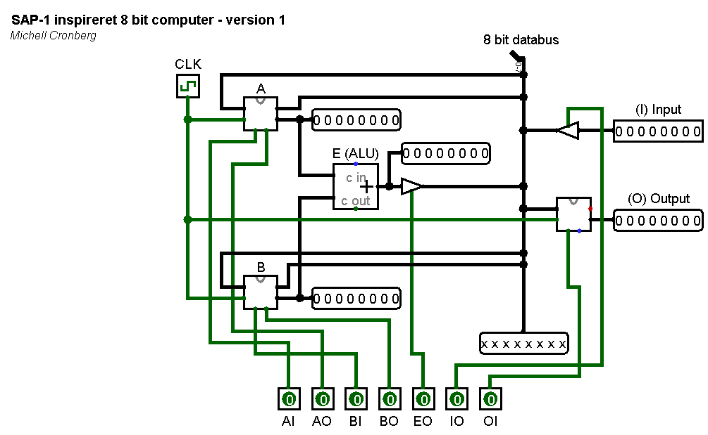
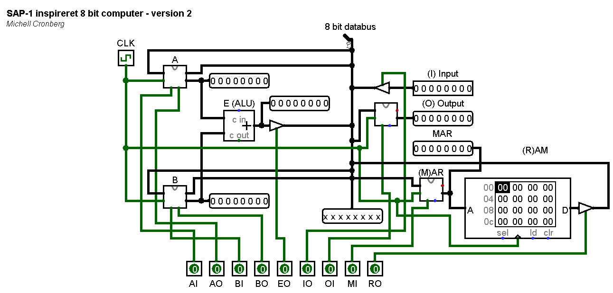

# Simpel CPU

Dette er forskellige versioner af en simpel SAP (Simple As Possible) CPU. De er brugt er undervisning i blandt "Introduktion til programmering", samt foredrag med videre. Du er velkommen til at benytte materialet blot du tydeligt angiver hvor materialet kommer fra.

Selve SAP arkitekturen kommer oprindeligt fra Albert Malvino, der brugte den i "biblen" - bogen [Electronic Principles](https://www.amazon.com/Electronic-Principles-Albert-Malvino/dp/0028028333). Den CPU arkitektur der er brugt her er simplificeret endnu mere, og er også inspireret af mange rundt omkring på nettet (der findes mange implementationer af en SAP-CPU), men især af [Ben Eater](https://eater.net/8bit/), som har en samling forrygende videoer der viser hvor en CPU kan opbygges på breadboards. De kan kraftigt anbefales hvis du har interesse i CPU design. Af bøger kan blandt anbefales [Code: The Hidden Language of Computer Hardware and Software](https://www.amazon.com/Code-Language-Computer-Hardware-Software/dp/0735611319) af Charles Petzold og [But How Do It Know? - The Basic Principles of Computers for Everyone](https://www.amazon.com/But-How-Know-Principles-Computers/dp/0615303765/ref=tmm_pap_swatch_0?_encoding=UTF8&qid=&sr=) af J Clark Scott.

Simuleringen benytter Logosim der både er vedlagt her men også kan findes på [http://www.cburch.com/logisim/](http://www.cburch.com/logisim/).

## Version 1 - simple kontrollinjer

Dette er den manuelle version af en CPU. Den består af 

- Et 8 bit A register
- Et 8 bit B register
- En 8 bit ALU som udelukkende kan lægge bit sammen fra A og B (ingen hensyntagen til mente)
- En 8 bit databus
- Et 8 bit output register
- Manual input til databus (til test)
- En clock

### Kontrollinjer

| A Reg In | A Reg Out | B reg In | B reg Out | ALU Out | Input Out | Output In |
| -------- | --------- | -------- | --------- | ------- | --------- | --------- |
| AI       | AO        | BI       | BO        | EO      | IO        | OI        |

### Eksempel: Tal fra input og læg det sammen med sig selv

Samtlige kontrollinjer skal påvirkes manuelt (brug ctrl + T til at få klokken til at slå)

- Tal i input
- Input Out (IO) + A In (AI)
- Input Out (IO) + B In (BI)
- ALU Out (EO) + Output In (OI)

## Version 2 - tilføjelse af RAM

Denne version er udvidet med RAM og et MAR (memory address register) register. Det resulterer et et par nye kontrollinjer - MI (MAR in) og RO (RAM out). Ideen er, at MAR indeholder en adresse i RAM som så kan hentes med RO.

### Kontrollinjer 

| A Reg In | A Reg Out | B reg In | B reg Out | ALU Out | Input Out | Output In | Mem Addr In | RAM Out |
| -------- | --------- | -------- | --------- | ------- | --------- | --------- | ----------- | ------- |
| AI       | AO        | BI       | BO        | EO      | IO        | OI        | MI          | RO      |

### Eksempel: Find et tal i RAM (adresse 0) og læg det sammen med sig selv

- Tal i RAM på adresse 0 
- 0 i input (0 ved reset)
- Input Out + MAR In
- Ram Out + A In
- A Out + B in
- ALU Out + Output In

## Version 3 - Mikrokode i stedet for manuel påvirkning af kontrollinjer

### Binære instruktioner

| A Reg In | A Reg Out | B reg In | B reg Out | ALU Out | Input Out | Output In | Mem Addr In | RAM Out |
| -------- | --------- | -------- | --------- | ------- | --------- | --------- | ----------- | ------- |
| AI       | AO        | BI       | BO        | EO      | IO        | OI        | MI          | RO      |
| 1        | 2         | 3        | 4         | 5       | 6         | 7         | 8           | 9       |

Find et tal i RAM (adresse 0) og læg det sammen med sig selv

- Placer tal i RAM på adresse 0 
- (0 i input) - ikke nødvendig fordi input = 0 ved reset
- 1010 0111 0 = A700 RESET ALT
- 0000 0101 0 = 0500 (IO+MI) 
- 1000 0000 1 = 8080 (AI+RO)
- 0110 0000 0 = 6000 (AO+BI)
- 0000 1010 0 = 0A00 (EO+OI)